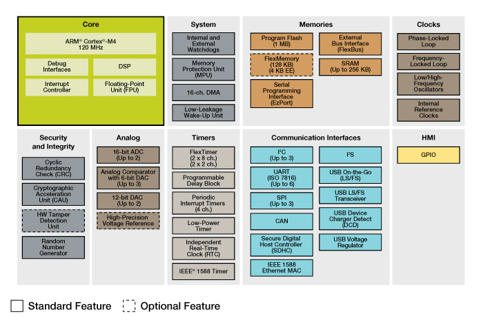

~~bga 主控~~ 
~~小~~
~~多层~~
~~usb~~
~~电源管理~~
~~扩展存储 也用BGA~~
~~调试接口~~
~~成本低~~
~~外部总线~~
~~随机数~~
~~加密~~
~~可以考虑FRDM-K64~~

* 小型化方法
    - 插接金手指
    - 核心板
    - 贴片金手指
    - 塔式结构金手指
    - 单板 

* mbed支持
    - NXP
        + KL
            ~~* KL25~~
            ~~* KL46~~
            ~~* KL05~~
            ~~* KL27~~
            ~~* KL43~~
            * KL82 
                - TRNG
                - AES SHA
                - USB
        + KK            
            ~~* K20~~
            ~~* K22~~
            * K64 

                - CAN
                - USB
                - SDHC
                - IEEE 1588
                - 随机数
                - crc cau
            * K66 
                - can
                - IEEE 1588
                - usb
                - SDHC
                - TRNG
                - CAU CRC
            * K82F 
                - 面向安全，有加密和随机数
                - USB
                - 150MHZ
        + KW
            * KW41Z 
                - AES
                - TRNG
                - 15.4
                - BT
                - cortex-M0
    - ST
        + STM32F7（好像是面向图像的） 
            * 有随机数发生器
            * CRC
            * can
            * usb
            * IEEE 1588v2 
            * HDMI
        + STM32F439ZI (QFP144) 
            * USB
            * TRNG
            * AES
            * SDIO
            * ETHERENT
    - MAXIUM
        + MAX32630FTHR 
            * USB
            * AES
            * PRNG
            * CRC
            * 96MHZ
[可视版本](https://github.com/whutddk/userpicture/blob/common-dev/初步设计需求.md)

